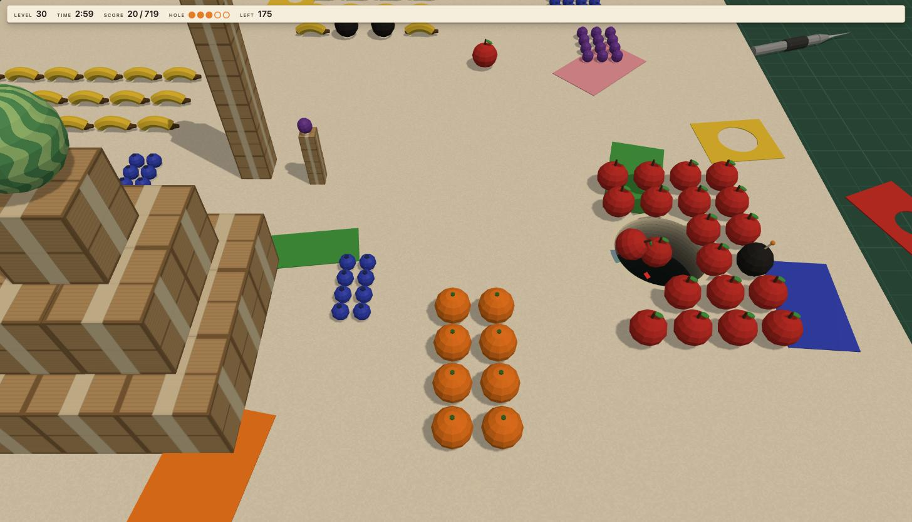

# Hole Punch

**[Play it now](https://bgeesaman.github.io/hole-punch/)**



A browser game built with three.js and Rapier. You steer a hole across a paper craft board and
eat fruit, crates, and bombs that fall in with real physics. 100 levels, each with a countdown,
a target score, and a hole that grows as you hit score milestones.

## Run locally

ES modules do not load from `file://`, so serve the folder with any static file server. The
`dev` script uses `serve`, installed as a dev dependency:

```sh
npm install
npm run dev                 # serve -l 5173 .
open http://localhost:5173
```

Any other static server works the same, for example `python3 -m http.server 5173`.

## Tests

```sh
npm install
npm test                    # vitest: scoring, generator, save, and headless Rapier physics
```

## Play

- The first time you start level 1 a card explains the game. Then click the board to capture
  the mouse. The hole follows it. Click again or press Escape to release the mouse, which
  pauses the clock and opens the pause menu.
- The pause menu has Resume, Restart, Levels, and the sound settings (music and effects, each
  off / low / normal). Escape on the level grid returns to the paused level.
- Fruit and crates score points when they fall in: 1, 5, or 20 by size. Bigger objects need a
  bigger hole. Bombs shrink the hole one step for eight seconds.
- The hole grows at 25 / 50 / 75 / 100 percent of the target. The lip of the hole is the
  progress bar: the south half fills toward the next size, the north half counts down a bomb.
- A level ends when the board is empty or the clock runs out. Reaching the target either way
  unlocks the next level. Clearing the board adds 10 points per second left, and clearing it
  with nothing lost off the edge adds another 25 percent. Three stars per level, replayable
  for a better score.
- From level 10 the camera follows the hole, so part of the board is off screen.
- Progress and sound settings are saved in `localStorage`.

## URL parameters

| Parameter    | Effect                                                             |
|--------------|--------------------------------------------------------------------|
| `?level=N`   | Skip the menu and start level N                                    |
| `?debug`     | Debug overlay; keys `[` `]` fake a milestone / bomb, `r` restarts, `n` `p` next / previous level; `window.holepunch` exposes the session, physics, camera, and `aim(x, z)` / `advance(seconds)` for scripting |
| `?nolock`    | Run without pointer lock; the hole follows the free cursor and the game runs unpaused (for automation) |
